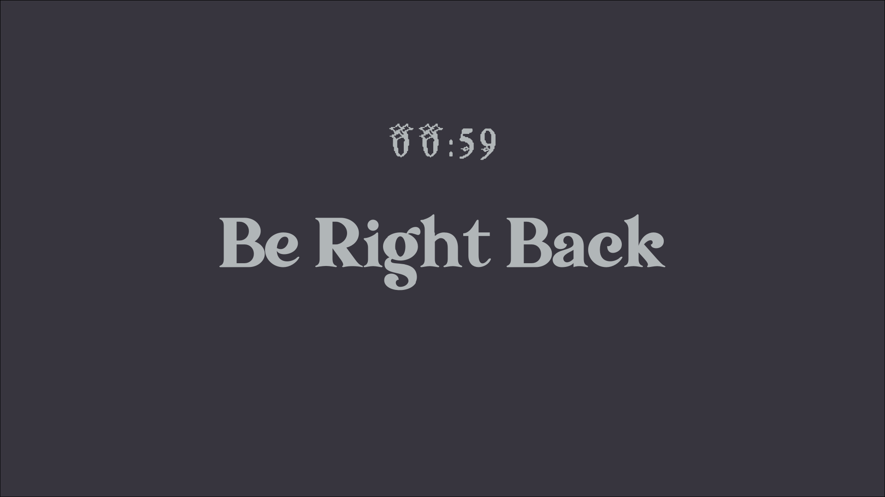

# holup
Hol' up is a tool made for streaming (just in case for myself), to show in case of a in-stream break for a couple minutes

Usage:
```
	holdup [hold | timer] [5]
```

 * Hold makes a countdown for the number of Minutes that you specified as the last argument
 * Timer Just Counts Up Infinitely



Roadmap:
	[] The frame mustn't overflow after hitting 00:00 rather hold there
	[] Some Music playing in the background.
	[] Text Configuration from argument.
